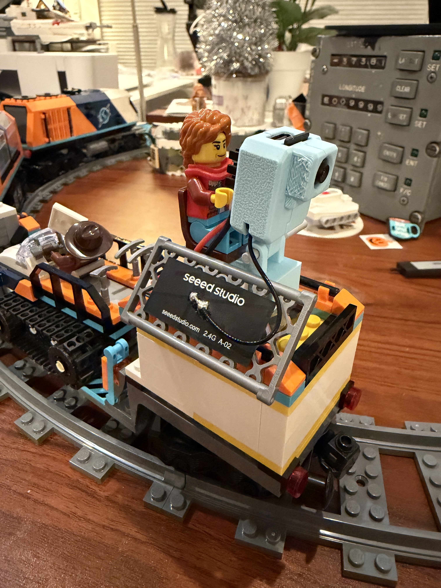
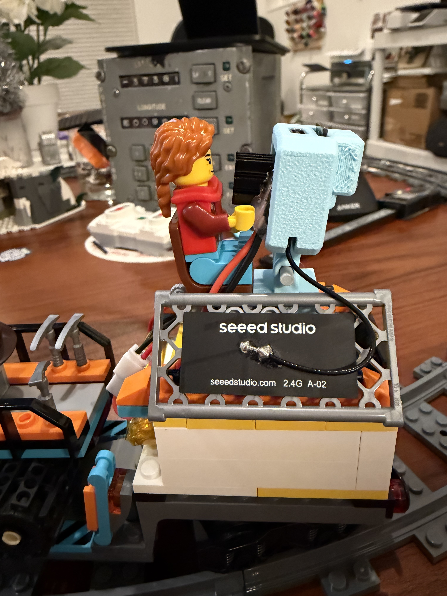

# Wildlife Spotter Train

[](https://github.com/keenanjohnson/Wildlife-Spotter-Train/actions/workflows/build-esp-idf.yml)

Explore the wilderness via Train! BLE-controlled LEGO City train using an ESP32-S3 microcontroller. Features real-time video streaming and playful interaction design. Currently in active development.


https://github.com/user-attachments/assets/2e25facd-4201-4223-821a-3176ae2201d8


This project is a Work in Progress but features:

- A small camera module attached to an ESP32-S3 microcontroller
- A 3D printed enclosure with integrated stand and antenna placement as well as LEGO compatible mounts
- Pybricks firmware running on the train to receive drive commands via Bluetooth
- ESP-IDF firmware on the camera module to stream video over UDP and send commands to the train via Bluetooth
- Fun

<p float="left">
  
  
</p>

https://github.com/user-attachments/assets/5a5532dc-e645-4069-b709-44a688e2fda8

## The story

I recently found myself in possesion of one of the Lego artic train sets, which is among one of the most fun recent kits. [kit link #60470](https://www.lego.com/en-us/product/explorers-arctic-polar-express-train-60470). On the back of the artic train is a camera tripod for spotting wildlife, specifically the artic foxes that are included in the kit.


I have recently been doing much ecology and as an embedded systems engineer, I thought it would be fun to improve the set by adding a real camera to the kit.

Additionally, I had seen the excellent [Pybricks](https://pybricks.com/) project and realized that I could also make a device via Bluetooth control and software GUI that would not only stream video but also control the driving of the train.

## System Architecture

```
                                    ┌─────────────────────┐
                                    │      Browser        │
                                    │    train.local      │
                                    └──────────┬──────────┘
                                               │ WiFi (HTTP)
                                               │ - Web UI
                                               │ - MJPEG stream
                                               │ - Train controls
                                               ▼
┌─────────────────────┐  BLE GATT  ┌─────────────────────┐
│   LEGO City Hub     │◄───────────│      ESP32-S3       │
│    (Pybricks)       │   stdin    │   Camera Module     │
│                     │  commands  │                     │
│  - Motor control    │            │  - OV2640 camera    │
│  - LED feedback     │            │  - WiFi AP/STA      │
│  - main.py program  │            │  - NimBLE central   │
└─────────────────────┘            └─────────────────────┘
```

The ESP32-S3 serves as the central hub:
- **WiFi**: Hosts a web interface for video streaming and train controls
- **BLE**: Connects to the LEGO hub as a GATT client to send motor commands
- **Camera**: Captures JPEG frames and streams via MJPEG over HTTP

## Project Structure

| Directory | Description |
|-----------|-------------|
| [camera/src/](camera/src/) | ESP-IDF firmware for the ESP32-S3 camera module. Streams video and controls train via BLE. |
| [camera/cad/](camera/cad/) | 3D printable enclosure designs for the camera module. |
| [train/](train/) | Pybricks Python code that runs on the LEGO City hub to receive BLE commands. |
| [desktop/](desktop/) | Python test application for receiving and displaying UDP video frames. |

## Building

### Camera Firmware (ESP-IDF)

The camera firmware requires [ESP-IDF v5.5.2](https://docs.espressif.com/projects/esp-idf/en/v5.5.2/esp32s3/get-started/index.html). See [camera/src/README.md](camera/src/README.md) for detailed build and flash instructions.

```bash
cd camera/src
source ~/.espressif/v5.5.2/esp-idf/export.sh
idf.py set-target esp32s3
idf.py menuconfig  # Configure WiFi credentials
idf.py build
idf.py -p /dev/cu.usbmodem* flash monitor
```

### Train Controller (Pybricks)

The train runs [Pybricks firmware](https://pybricks.com/). See [train/README.md](train/README.md) for setup.

```bash
pip install pybricksdev
pybricksdev run ble my_program.py
```

